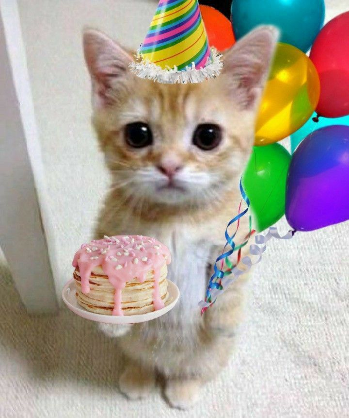
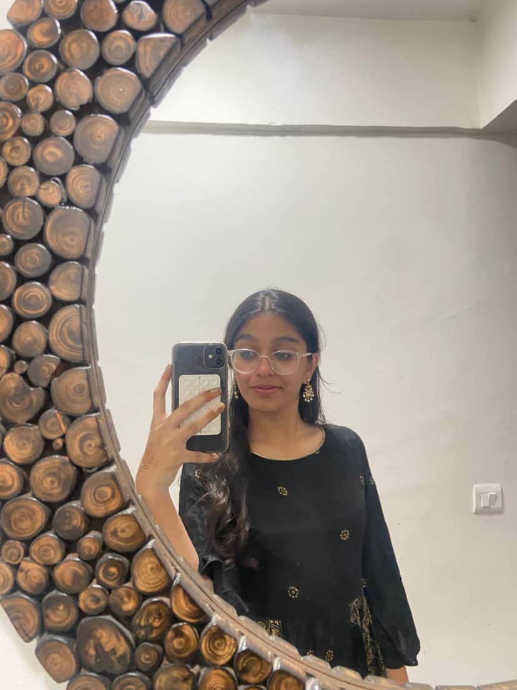

# birthday-card
<!DOCTYPE html>
<html lang="en">
<head>
  <meta charset="utf-8" />
  <meta name="viewport" content="width=device-width,initial-scale=1" />
  <title>Happy Birthday Avishka</title>
  
</head>
<body>
  <h1 id="title" style="opacity:0; transform:translateX(-100px); transition:1s">Pop All 6 Balloons 🎈</h1>

  

  <!-- Cake section -->
  

    <h2>🎂 Click the Cake 15 Times 🎂</h2>
    

      

        

        

        

      

      

      

      

    

    
Click the cake until the flames go out!

  

  <!-- mail image -->
  

    
  

  <!-- final page -->
  

    <h1>Happy Birthday Avishka 🎉💖</h1>
    
You are amazing, special and truly precious. Enjoy your day! 💕

    
    <!-- Cats and Avishka photo -->
    

      
      
      
    

    
🎉🎂✨🍰🥳🎂🎈🎉🥳🎉🎂🎀💗🥳🥂✨🧁

  

  

  <!-- background music -->
  <audio id="bg-music" src="https://cdn.pixabay.com/download/audio/2022/03/15/audio_7ab14f392e.mp3?filename=lofi-hip-hop-100-bpm-10977.mp3" autoplay loop></audio>
</body>
</html>
